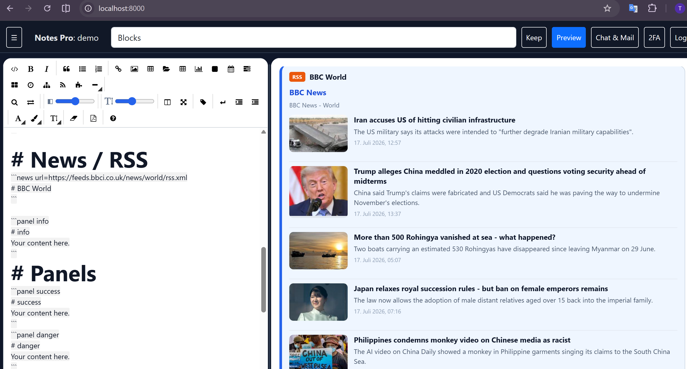
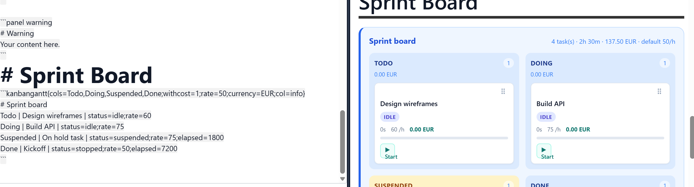
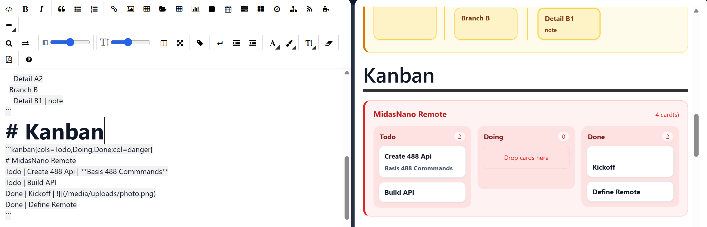
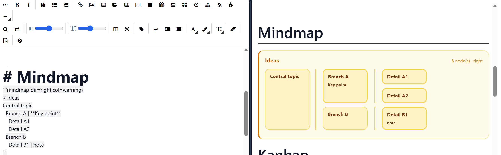
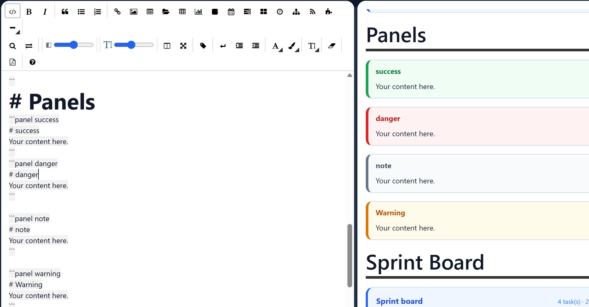
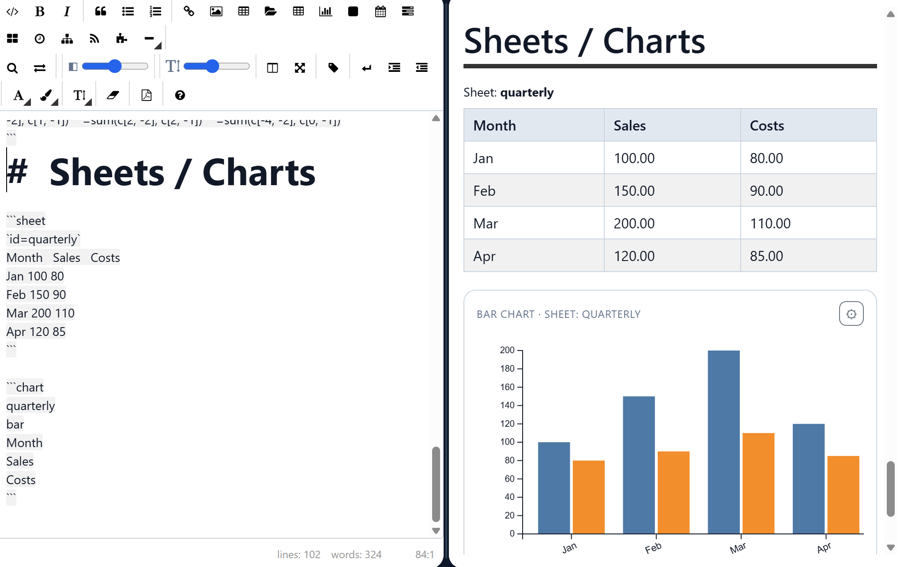
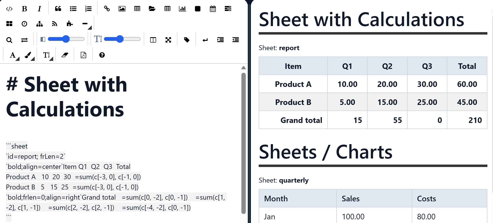
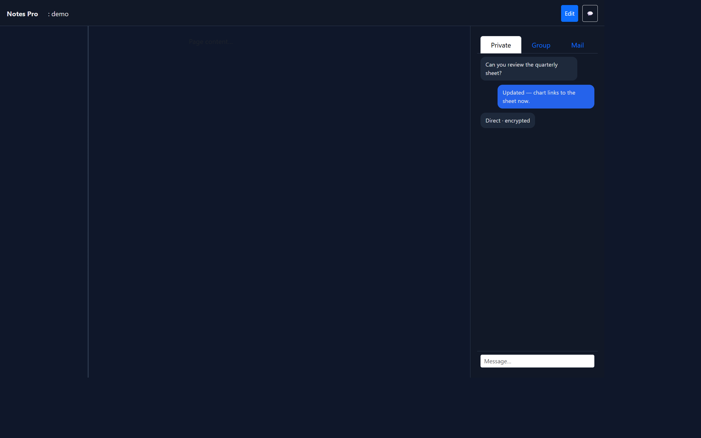
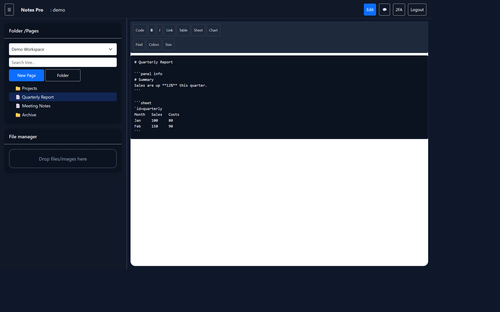
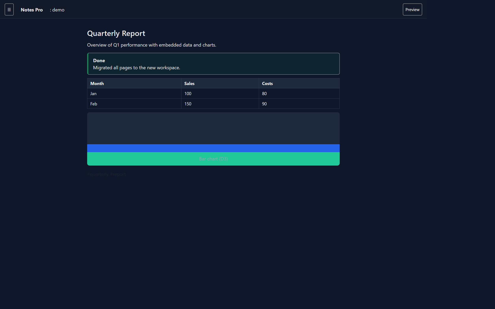

# Notes Pro

Collaborative notes app with workspaces, markdown editing, embedded spreadsheets and charts, team chat, and encrypted messaging.
##  Live Demo
https://thgsoft.online/DjangoNotesPro/
## Screenshots

### RSS Feeds

### Sprintboard

### Kanban  

### Mindmap

### Panels

### Sheets & Charts

### Sheets with Calculation



## Features
- Multiple workspaces with members, roles, and email invites
- jsTree page/folder tree with search, drag-and-drop reorder, inline rename
- **Per-workspace page memory** — last opened page is restored when you switch workspaces
- EasyMDE markdown editor with split edit + live preview, synced scrolling, and floating TOC
- **Two-row editor toolbar** — structure tools on the first row; find/replace, indent, colors, and font size on the second
- **Find / replace** bar above the editor (`Ctrl+F`, `Ctrl+H`, `F3`); **Replace all** for bulk edits
- **Snippets** — reusable text blocks (toolbar + sidebar); stored in your user settings
- **Colored panels** — info / success / warning / danger / note callout blocks in markdown
- Tab-separated `sheet` blocks (formulas) and D3 `chart` blocks linked by sheet id
- **Calendar** blocks — list days, weeks, months, or years for a `from`/`to` range
- **Gantt** / **Kanban** / **Kanban Gantt** / **Mindmap** blocks — project timelines, boards, timed cost tracking, and indented idea trees
- File manager with drag-and-drop uploads; click images to open in a new tab
- **Local file links** — paste Windows paths or insert via toolbar; click in preview to reveal in Explorer (local dev server)
- Resizable dashboard panels (sidebar, editor, chat/mail)
- Dark dashboard UI
- **Keep** — Google Keep–style quick notes per workspace (pin, colors, checklists, archive, drag reorder, markdown)

### Chat & mail
- **Private chat** — WhatsApp-style 1:1 messages, end-to-end encrypted in the browser (ECDH + AES-GCM)
- Optional **P2P delivery** via WebRTC when both users are online; server relay as fallback
- **Group chat** — workspace-wide channel (Chat panel → **Group** tab)
- Workspace **mail** (inbox, sent, compose)
- Start a private chat from the member list (💬) or by searching users in the Private tab

### Security
- **TOTP two-factor authentication** (setup from the dashboard top bar)
- **Database encryption at rest** for page content, chat, mail, DM ciphertext, and TOTP secrets (Fernet)
- Direct messages: encrypted client-side first, then encrypted again in the database

## Install

```bash
python -m venv .venv
```

**Linux / macOS**

```bash
source .venv/bin/activate
pip install -r requirements.txt
python manage.py migrate
python manage.py createsuperuser
python manage.py seed_demo   # optional demo workspace + README page with screenshots
python manage.py runserver
```

**Windows (PowerShell)**

```powershell
.venv\Scripts\Activate.ps1
pip install -r requirements.txt
python manage.py migrate
python manage.py createsuperuser
python manage.py seed_demo   # optional demo workspace + README page with screenshots
python manage.py runserver
```

Open:
- http://127.0.0.1:8000/login/
- Demo user after `seed_demo`: `demo` / `password` — workspace **Docs → README** contains this guide with screenshots; **Docs → Blocks** has gantt/calendar/mindmap/kanban/panel examples; **Docs → RSS Feeds** embeds BBC / DE / CH news feeds

Copy `.env.example` to `.env.dev` (or set `DJANGO_ENV`) for local settings. See [Email invitations](#email-invitations) and [Database encryption](#database-encryption) below.

## Database encryption

Sensitive fields are encrypted at rest in SQLite. In **development**, a key is derived from `SECRET_KEY` if `DB_ENCRYPTION_KEY` is not set.

**Production** — set a dedicated Fernet key (back it up; losing it means data loss):

```bash
python -c "from cryptography.fernet import Fernet; print(Fernet.generate_key().decode())"
```

Add to your environment or `.env`:

```
DB_ENCRYPTION_KEY=your-generated-key-here
```

For local file links from preview, keep `LOCAL_FILE_OPEN_ENABLED=true` only on trusted local/dev hosts (default when `DEBUG=true`). Set `LOCAL_FILE_OPEN_ENABLED=false` in production.

After upgrading from an older version, run migrations and optionally:

```bash
python manage.py encrypt_db_fields
```

## Chat

Open the **Chat** panel (💬 in the top bar).



| Tab | Purpose |
|-----|---------|
| **Private** | Encrypted 1:1 chats; search users or message a workspace member |
| **Group** | Shared workspace channel for all members |

Private chat requires both users to open the Private tab at least once so encryption keys are created in the browser. Status line shows **Direct · encrypted** when P2P is active, or **Private · encrypted** when using server relay.

## Email invitations

By default, emails use the **console backend** — they are **not** sent to a real inbox. They print in the terminal where `runserver` is running.

### Option A: Read emails in the terminal (default)

Run `python manage.py runserver` and watch that window when you click **Send invitation**.

### Option B: Save emails as files

```powershell
$env:DJANGO_EMAIL_BACKEND="file"
python manage.py runserver
```

Messages are written under `sent_emails/`.

### Option C: Real SMTP (Gmail, Outlook, …)

Set environment variables before starting Django (see `.env.example`):

```powershell
$env:DJANGO_EMAIL_BACKEND="smtp"
$env:EMAIL_HOST="smtp.gmail.com"
$env:EMAIL_PORT="587"
$env:EMAIL_USE_TLS="true"
$env:EMAIL_HOST_USER="you@gmail.com"
$env:EMAIL_HOST_PASSWORD="your-app-password"
$env:DEFAULT_FROM_EMAIL="you@gmail.com"
$env:SITE_URL="http://127.0.0.1:8000"
python manage.py runserver
```

Test delivery:

```bash
python manage.py send_test_email someone@example.com
```

**Note:** If the invitee already has an account with that email, they are added directly and get a “you were added” notification instead of a signup invite link.

**Unregistered users:** In the members panel, type an email address in the search box (or use **Invite by email**). If no matching account exists, choose **Invite … (not registered)** to send an invitation email. Pending invites appear in the member list until accepted.

**Owner notification:** When someone registers with the invited email address, workspace owners receive an email that the new user joined their workspace.

## Sheets

Sheets are tab-separated tables embedded in markdown as fenced `sheet` blocks. Tables render at **≤ 100%** page width. They support formulas, per-cell styling, **markdown images in cells**, and can be linked from `chart` blocks by sheet id.

Use the **Insert sheet** toolbar button in the markdown editor, or type a block manually:


```sheet
`id=quarterly; frLen=2; align=left
Month	Sales	Costs
Jan	100	80
Feb	150	90
Mar	200	110
Apr	120	85
```


Set default **column width** on the fence (semicolon-separated attributes):


```sheet{width=25%; id=screenshots}
Overview	Editor	Preview	Chat
			
```


Column `%` widths are scaled down if their sum exceeds 100%.

### Syntax

| Rule | Description |
|------|-------------|
| **Columns** | Separate cells with a **tab** character (not spaces). Leading/trailing tabs keep empty cells at the start or end of a row. |
| **Config line** | Optional first line in backticks: `` `key=value;key2=value2` `` |
| **Data rows** | One row per line after the config line. |
| **Empty rows** | Use a lone `` ` `` on the line so a fully blank row is kept — a line with only spaces is dropped. Tab-only lines are kept as empty cells. The `` ` `` placeholder is hidden in preview. |
| **Header row** | The **first data row** is treated as column headers by default (`<thead>`). |
| **Formulas** | A cell starting with `=` is evaluated (see below). |
| **Format cell** | A cell wrapped in backticks sets formatting for that cell and all following cells until the next format cell (see below). |
| **Fence attrs** | Optional `{key=value;…}` on the opening fence, e.g. `` ```sheet{width=25%; id=foo} `` — same keys as config/format (column `width`, `id`, `align`, …). |
| **Close fence** | End the block with `` ``` `` on its **own line** before the next markdown (headings, text, …). |

### Sheet config (backtick line)

The optional first line sets **sheet-wide** options (`id`, `header`, `frLen`, …). You can **chain a format block** on the same line so the header row gets that style:


`id=styled``bold;align=center;bg-col=yellow;frlen=0;font-size=48px`
Month	Sales


First `` `id=styled` `` → sheet id for charts. Second `` `bold;align=center;…` `` → carry-forward format applied from the header row onward (no tab between the two blocks).

Sheet config keys (semicolon-separated inside one `` `…` `` block):

| Key | Description |
|-----|-------------|
| `id` or `sheet` | Sheet name used by `chart` blocks on the same page. |
| `header=0` / `false` / `no` | Treat every row as data (no header row). |
| `frLen=N` | Default decimal places for numeric display and formulas (default `2`). |
| `align=left` / `center` / `right` | Default cell alignment. |
| `col=blue` / `#777` | Default text color (CSS name or hex). |
| `bg-col=#eee` / `yellow` | Default background color (CSS name or hex). |
| `font-size=medium` | Table font size (`small`, `medium`, `large`, or CSS size). |

Example without header row:


```sheet
`id=raw; header=0
10	20	30
40	50	60
```


### Cell format (backtick, carry-forward)

Set formatting by putting a **backtick-wrapped directive** in a cell. Syntax matches the sheet config line: semicolon-separated tokens inside backticks.


`bold;align=center;frlen=0;col=blue;bg-col=#eee`


That cell and **all following cells** (left-to-right, top-to-bottom) use the format until another format cell appears.

A format prefix may be **glued to cell text** (no tab after the closing backtick): `` `bold;align=center`Month `` renders as “Month” with that format. A format-only cell uses backticks alone: `` `bold;align=center` ``.

| Token | Effect |
|-------|--------|
| `bold` | Bold text |
| `normal` / `nobold` | Turn bold off |
| `frlen=N` | Decimal places for formula results (cells starting with `=`) |
| `align=left` / `center` / `right` | Cell text alignment |
| `col=blue` / `#777` | Text color (CSS color name or `#hex`) |
| `bg-col=#eee` / `yellow` | Background color (CSS name or `#hex`) |
| `font-size=small` / `medium` / `large` / `12px` | Cell font size |
| `width=25%` / `120px` | **Cell/column** width (carry-forward); images scale to fit the cell |
| `col=none` / `bg-col=none` / `font-size=none` / `width=none` | Clear text, background, font size, or image width |

Only listed options change; others keep their previous value (including sheet defaults from the config line).

**Alternate syntax** (comma-separated, no backticks): `style=bold,col=blue,bg-col=#777`

Example:


```sheet
`id=styled``bold;align=center;bg-col=yellow;frlen=0;font-size=48px`
Month	Sales
`bg-col=green;frlen=0;font-size=12px`
Jan	100
Feb	150
Mar	200
`frlen=0;align=center;col=#2563eb`Total	`frlen=0;align=center`=sum(c[0, -2], c[0, 0])
```


- **Line 1** — sheet id + header format (yellow, bold, 48px) for Month/Sales  
- **Line 3** — format-only row switches data rows to green / 12px  
- **Total row** — format glued to label and formula cells

### Formulas

Cells starting with `=` are formulas. Invalid formulas show `#ERR!`.

#### Relative cell reference

`c[col, row]` — offsets relative to the **current** cell. **Column first**, then row.

| Reference | Meaning (from current cell) |
|-----------|----------------------------|
| `c[0, -1]` | Same column, one row above |
| `c[-1, 0]` | One column left, same row |
| `c[1, 1]` | One column right, one row below |

Missing or non-numeric cells count as `0` in formulas.

#### Sum of a rectangular area


=sum(c[col1, row1], c[col2, row2])


Sums all numeric cells in the inclusive rectangle between the two corners. Corner order does not matter. Case-insensitive: `SUM(...)` works too.

Example — total of three cells in the same row:


=sum(c[-2, 0], c[0, 0])


#### Sum above (same column)


=SUM_ABOVE


Adds all numeric values above the current cell in the same column.

#### Math expressions

After `c[…]` and `sum(…)` are expanded, the rest is plain JavaScript math. Available helpers:

`sqrt`, `sqr`, `abs`, `round`, `pow`, `ln`, `log`, `exp`, `ceil`, `floor`, `PI`, `E`

Examples:


=c[0, -1] + c[-1, 0]
=sqrt(c[0, -1].2)
=round(c[0,-1] * 1.19)


#### Decimal places

- Default from sheet `frLen` or active cell `style=frlen=N`.
- Override for one formula with a **`.N` suffix** after a cell reference (stripped before evaluation): `=c[0,-1]+c[0,-2].0` → integer result. Decimals inside the expression (e.g. `=c[-2,0]*0.35`) are kept as numbers.

Formulas are evaluated **row by row, left to right**. References to cells not yet evaluated may still contain raw formula text and are treated as non-numeric.

### Editing sheets in preview

1. Click **Edit** on the page (markdown + preview side by side).
2. Click a sheet cell in the preview to edit inline.
3. Press **Enter** or click away to save; press **Esc** to undo changes since focus (restores the cell value from when you clicked it).
4. While a cell is focused (empty or formula starting with `=`), **Shift+click another cell** in the same sheet to insert a relative reference (`c[col, row]`, e.g. `c[-1, 0]`). Empty cells get `=` prepended automatically.

**Numbers** — cells without a leading `=` are shown as plain text (`2026` stays `2026`, not `2026.00`). Formula cells (`=…`) are evaluated and formatted with `frlen`. Formulas still parse Swiss/European number formats in referenced cells, such as `1'356.788` or `1'356,788`.

**Sheet structure shortcuts** (while a **whole row or column** is selected in preview edit mode):

1. Click the **column band** above a column header, or the **row band** left of a row, to select the full column/row (highlighted in blue).
2. Use the **`+` / `−` buttons** in that band — a menu asks **above/below** (rows) or **left/right** (columns) for insert, and **this / above-below / left-right** for delete.
3. Keyboard (with a band selected): **`+`/`-`** column insert-before / delete-this (on the **last column**, `+` asks left/right); **`°`/`Shift+-`** row insert-above / delete-this (on the **last row**, `°` asks above/below). Delete keys always open the placement menu.
4. Click any cell to clear the band selection and edit cell contents.

On Swiss/German keyboards, `°` and `+` share one key — unshifted selects/adds rows via `°`, shifted (`+`) adds columns when a column band is selected.

Header cells are editable too. In read-only preview (not editing), cells are not editable. Editing a formula cell replaces the formula with the typed value.

**Images in cells** — any cell (header or data) can contain markdown images. They render as pictures in preview; edit the markdown in the sheet block (not inline in preview).

Set **column width** with `` ```sheet{width=25%} `` on the fence, a format token (`width=25%` in backticks, carry-forward), or both. Images scale to fit the cell. Override image size only with inline `{width=20%}` on the markdown image.

After `python manage.py seed_demo`, image paths in **Docs → README** are rewritten to `/media/uploads/…` automatically.

### Full example (data + format + formulas)


```sheet
`id=report; frLen=2
`bold;align=center`Item	Q1	Q2	Q3	Total
Product A	10	20	30	=sum(c[-3, 0], c[-1, 0])
Product B	5	15	25	=sum(c[-3, 0], c[-1, 0])
`bold;frlen=0;align=right`Grand total	=sum(c[0, -2], c[0, -1])	=sum(c[1, -2], c[1, -1])	=sum(c[2, -2], c[2, -1])	=sum(c[-4, -2], c[0, -1])
```


## Charts

Charts read data from a `sheet` block on the same page (matched by `id`). Use **Insert chart** in the toolbar to pick sheet, type, and X/Y columns.

Define data in a sheet block first:


```sheet
`id=quarterly
Month	Sales	Costs
Jan	100	80
Feb	150	90
Mar	200	110
Apr	120	85
```


Render a D3 chart from that sheet:


```chart
quarterly
bar
Month
Sales
Costs
```


Multiple Y columns produce **grouped bars** (or multiple lines). You can also use comma-separated names in one config line:

`` `sheet=quarterly; type=bar; x=Month; y=Sales,Costs` ``

Chart types: `bar`, `line`, `scatter`, `pie`. Pie charts use the first Y column only. Column names can be header names or `0`-based indices.

In preview, use the chart **settings** (gear) to switch type, toggle data points, and change X / left Y / right Y axes; settings are saved per page in your user preferences.

## Markdown editor


### Edit vs preview

| Mode | How |
|------|-----|
| **Edit** | Top bar **Edit** — EasyMDE toolbar, markdown source, and live preview side by side |
| **Preview** | Top bar **Preview** — rendered page only (full width; chat panel auto-hides) |

Writers and workspace owners start in edit mode; read-only members see preview only.

### Find / replace

Available in edit mode: toolbar icons or **Find** / **Replace** bar above the editor.

| Shortcut | Action |
|----------|--------|
| `Ctrl+F` | Find |
| `Ctrl+H` | Replace |
| `F3` / `Shift+F3` | Next / previous match |
| `Esc` | Close find bar |

Use **Replace** for the current match and **All** to replace every match in the page.

### Toolbar formatting

The editor toolbar wraps across two rows. Formatting controls are on the second row.

#### Font size

**Text size** dropdown (text-height icon):

| Option | Effect |
|--------|--------|
| bigger | 150% |
| big | 125% |
| normal | Remove font-size markup |
| small | 87.5% |
| smaller | 75% |

Select text (or place the cursor on a line), then pick a size. Sizes are stored as inline `<span style="font-size:…">` in the markdown source.

#### Text and background color

**Text color** (font icon) and **Background color** (brush icon) each offer:

| Preset | Bootstrap color |
|--------|-----------------|
| red | danger |
| blue | primary |
| light blue | blue tint |
| yellow | warning |
| light green | green tint |
| green | success |
| cyan | info |

Click a preset to apply it to the selection (or current line).

**Color palette** opens a floating picker with the presets plus orange, teal, purple, pink, indigo, secondary, and dark. **Click** a swatch to preview; **double-click** to apply and close. Use **Custom** + **Apply** for any other color.

#### Indent and outdent

Toolbar **indent** / **outdent** buttons, or `Tab` / `Shift+Tab` in the markdown editor.

In split preview while editing:

- Plain text lines — add or remove leading spaces in the source
- Colored **panel** blocks — indent panel body lines
- **Sheet** cells — `Tab` indents the cell value; use row/column band **`+`/`−`** buttons (or `+`/`-` / `°`/`Shift+-` shortcuts) to change structure

#### Clear formatting

**Remove formats** (eraser icon) strips inline HTML (`<span>`, `<b>`, etc.) from the selection or current line.

### Snippets

Reusable text blocks stored in your user settings (`extra_configs.snippets`).

- **Toolbar** — puzzle-piece icon → manage, edit, insert
- **Sidebar** — **Snippets** panel → quick insert or **Manage snippets…**

### Colored panels

Insert via the toolbar **panel** button (square icon) or manually:


```panel info
# Optional title
Panel content with **markdown**.
```


| Type | Use |
|------|-----|
| `info` | Blue — general information |
| `success` | Green — positive / completed |
| `warning` | Amber — caution |
| `danger` | Red — important / error |
| `note` | Gray — neutral note |

Optional title: first line `# Title` or `title: My title`.

### Local file links

Link to files on your PC (paths with spaces are supported):

markdown
[Report](file:///C:/Users/you/My Documents/report.pdf)


Or paste a path from Explorer (**Shift+Right click → Copy as path**) into the editor.

- **Insert** — toolbar folder icon or sidebar **Link local file…**
- **Preview click** — opens the file in Explorer / Finder when Django runs on the same machine (`LOCAL_FILE_OPEN_ENABLED`, on by default in dev)

### Keep

Quick notes are separate from the page tree — lightweight sticky notes for each workspace.

- Open from the top bar **Keep** button (toggle back with the same button or by clicking a page/folder in the tree).
- **Composer** at the top: title, body (markdown), optional checklist, and card color.
- **Cards** in a grid: pin, recolor, checklist, archive, or delete from the card footer on hover. Collapsed cards render markdown (bold, lists, links, images, …); expand to edit the source.
- **Drag and drop** cards to reorder (writers only). Dropping onto a pinned/unpinned card moves the note into that group. Disabled while search is active.
- **Search** filters title and body; **Show archived** lists archived notes.
- Pinned notes stay at the top; your last view (**Pages** vs **Keep**) is saved in user settings.
- Writers can create and edit notes; read-only members can view them.

### Tags

Tags are indexed per page and shown in a tag bar below the preview. Use brace syntax only:

| Syntax | Example |
|--------|---------|
| Brace | `{tag: WLAN}` |

Spaces and mixed case are supported (`{tag: Haefely}`). Markers are hidden in preview; tags appear in the tag bar as `{tag: …}`.

You can also use the toolbar **tag** button on selected text.

### Calendar

Embed a calendar for a date range with a fenced `calendar` block (also accepts the typo `calender`):

markdown
```calendar{from=1.1.26;to=1.7.26;mode=day}
```


| Option | Description |
|--------|-------------|
| `from` / `to` | Range bounds as `D.M.YY`, `D.M.YYYY`, or `YYYY-MM-DD` |
| `mode` | `day` · `week` · `month` · `year` — only that unit is listed |
| `col` | Background theme: panel colors `info` / `success` / `warning` / `danger` / `note`, or a CSS color (`#eee`, `yellow`) |
| `title` | Optional title (otherwise the date range is shown) |

Examples:

markdown
```calendar{from=1.1.26;to=1.7.26;mode=day;col=info}
```


- `mode=day` — days in week rows (Mon–Sun), grouped under each month  
- `mode=week` — weeks grouped per month  
- `mode=month` — months grouped per year  
- `mode=year` — separate years  
- `col=success` — green panel-style background (same palette as colored panels)  

Use the toolbar **calendar** button to insert a day-mode block for the current month. Preview and edit split view both render it.

In **Edit** mode, click a day / week / month / year chip in the preview to add **markdown text** and an optional **image**. Notes are stored inside the fence. Multiple lines with the same key are all shown on that unit.

Day notes can be **all-day** or timed (`HH:MM` or `HH:MM-HH:MM` after the key). Set **Start** and **Until** in the note dialog (or write a date range in the key) for a **multi-day period**:

markdown
```calendar{from=1.1.26;to=1.7.26;mode=day}
@d:15.01.26 | **Meeting** with _Team_ | 
@d:15.01.26 | Follow-up call
@d:20.01.26-25.01.26 | Vacation
@d:10.02.26-12.02.26 | 09:00-17:00 | Conference
```


Multi-day keys use `@d:from-to` (same `D.M.YY` dates; `..` also works as separator). In preview, a **colored line** runs along the **bottom** of the covered days; overlapping periods stack with the **newest line above** older ones. **Times** stay visible on desktop (time only for daily timed notes; title in the tooltip). On **mobile**, day events show as **points** only (details in the tooltip). Period **titles** stay on the **start** day bar on desktop. Click a time, point, or line to edit.

markdown
```calendar{from=1.1.26;to=1.7.26;mode=year;col=danger}
@y:2026 | Geburtstage: **Thomas** _xx.xx.xx_
@y:2026 | Geburtstage: **Eva** _1.2.2000_
```


### Gantt

Embed a simple Gantt chart with a fenced `gantt` block (also accepts `gant`):

markdown
```gantt{from=1.1.26;to=31.1.26;col=info}
# Project plan
Phase A | 1.1.26 | 15.1.26 | **Start**
Phase B | 15.1.26 | 31.1.26 | Delivery | 
```


| Option | Description |
|--------|-------------|
| `from` / `to` | Chart range (`D.M.YY`, `D.M.YYYY`, or `YYYY-MM-DD`). Inferred from tasks if omitted |
| `col` | Theme: `info` / `success` / `warning` / `danger` / `note`, or a CSS color |
| `title` | Optional title via fence `title=…`, body `# Title`, or `title: …` (otherwise the date range is shown) |

Each task line is:

`Label | from | to | optional markdown | optional `

Use the toolbar **gantt** button to insert a sample block for the current month. In **Edit** mode, click the **title** to edit name and range, or click a **task row** to edit label, dates, note, and image.

### Kanban

Embed a Kanban board with a fenced `kanban` block (also accepts `kanb`):

markdown
```kanban{cols=Todo,Doing,Done;col=info}
# Board
Todo | Design wireframes | **First draft**
Doing | Build API
Done | Kickoff | 
```


| Option | Description |
|--------|-------------|
| `cols` | Comma-separated column names (default `Todo,Doing,Done`) |
| `col` | Theme: `info` / `success` / `warning` / `danger` / `note`, or a CSS color |
| `title` | Optional title via fence `title=…`, body `# Title`, or `title: …` |

Each card line is:

`Column | Label | optional markdown | optional `

You can also group with `## Column` headings and write `Label | note` under each.

Use the toolbar **kanban** button to insert a sample board. In **Edit** mode, **drag cards** between columns (or reorder within a column), click the **title** to edit name/columns, or click a **card** to edit label, column, note, and image.

### Kanban Gantt

A kanban board with per-task timers and hourly cost rollups. Fence name: `kanbangantt` (also `kbgantt` / `kgantt`):

markdown
```kanbangantt{cols=Todo,Doing,Suspended,Done;withcost=1;rate=50;currency=EUR;col=info}
# Sprint board
Todo | Design wireframes | status=idle;rate=60
Doing | Build API | status=running;rate=75;started=14.07.26 09:15;elapsed=3600
Suspended | On hold task | status=suspended;rate=75;elapsed=1800
Done | Kickoff | status=stopped;rate=50;elapsed=7200
```


| Option | Description |
|--------|-------------|
| `cols` | Comma-separated column names (default `Todo,Doing,Suspended,Done`) |
| `withcost` | Show rates and cost totals (`1` / `0`, default `1`). Also `costs` / `showcost` |
| `rate` | Default cost per hour for tasks without their own `rate` (used when `withcost=1`) |
| `currency` | Display currency (default `EUR`) |
| `col` | Theme: `info` / `success` / `warning` / `danger` / `note`, or a CSS color |
| `title` | Optional title via fence `title=…`, body `# Title`, or `title: …` |

Each task line is:

`Column | Label | status=…;rate=…;elapsed=…;started=… | optional markdown | optional `

| Field | Meaning |
|--------|---------|
| `status` | `idle` / `running` / `suspended` / `stopped` |
| `rate` | Cost per hour for this task (falls back to board `rate`) |
| `elapsed` | Accumulated seconds (paused time) |
| `started` | When the current run began (`DD.MM.YY HH:MM`) — only while `running` |

**Suspended column:** default boards include a **Suspended** category. Clicking **Suspend** pauses the timer and moves the task there. **Resume** (Start) moves it back to **Doing** and continues timing.

**Cost** = `(elapsed + live running time) / 3600 × rate`. The board footer and each column show totals.

Use the toolbar **kanban gantt** button to insert a sample. In **Edit** mode:

- **Start** / **Suspend** / **Stop** on a card update status and elapsed in the markdown
- **Drag** tasks between columns (or reorder within a column) using the **⠿ handle** on each card
- Click the **title** for board rate/currency/columns and the **With cost** toggle, or a **card** (outside the buttons) to edit rate, status, note, and image

Turn off **With cost** (`withcost=0`) for a time-only board: rates and money totals are hidden; timers still work.

### Mindmap

Embed a mindmap with a fenced `mindmap` block (also accepts `mmap` / `mind`):

markdown
```mindmap{dir=right;col=info}
# Ideas
Central topic
  Branch A | **Key p
  Branch B
    Detail B1 | note
```


| Option | Description |
|--------|-------------|
| `dir` | `right` (horizontal tree, default) or `down` (vertical) |
| `col` | Theme: `info` / `success` / `warning` / `danger` / `note`, or a CSS color |
| `title` | Optional title via fence `title=…`, body `# Title`, or `title: …` |

Tree structure uses **indentation** (2 spaces or a tab per level). Each line is:

`Label | optional markdown | optional `

Use the toolbar **mindmap** (sitemap) button to insert a sample. In **Edit** mode, click the **title** to change name/direction, or click a **node** to edit label/note/image, add a child, or delete the node.

### News / RSS (Magpie-style)

Embed a live RSS or Atom feed with a fenced `news` block (alias: `rss`):

````markdown
```news url=https://feeds.bbci.co.uk/news/world/rss.xml
# World news
```
````

Or with brace options:

````markdown
```news{url=https://feeds.bbci.co.uk/news/world/rss.xml;limit=8;col=info}
```
````

| Option | Description |
|--------|-------------|
| `url` | Feed URL (`feed` / `src` also accepted) |
| `limit` | Max items (1–50, default 10) |
| `col` | Theme: `info` / `success` / `warning` / `danger` / `note` |
| `title` | Optional heading (or a `# Title` line in the body) |

The server fetches and caches the feed asynchronously (like MagpieRSS, non-blocking on ASGI), then the preview shows channel title, linked item titles, **thumbnails** (when the feed provides `media:thumbnail`, image enclosures, or inline ``), short descriptions, and dates. Preview paints from a client cache so typing does not flash “Loading…”. Use the toolbar **RSS** button to insert a BBC World News sample.

## Notes

- Markdown images support optional size and alignment: `{width=50%}` or `{width=120px; align=center}`. Pasted screenshots default to `{width=100%}`.
- Markdown images and attachments use `/api/uploads/`; preview and chat images open in a new browser tab when clicked.
- File manager lists uploads for the current workspace.
- Workspace export/import and soft-delete are available via the API and admin tools.
- Layout (sidebar width, panel sizes, last page per workspace) is persisted in **User settings**.
